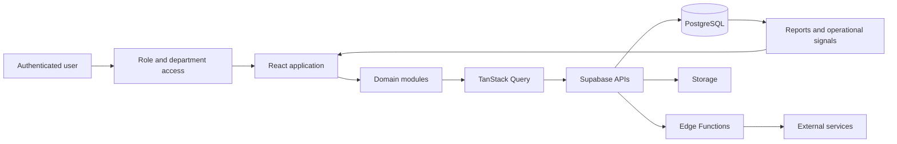

# Company Portal — Product Engineering Case Study

> A role-based operating system that brings sales, delivery, marketing, HR, training, quality assurance, reporting, and executive operations into one application.

## At a glance

| | |
| --- | --- |
| **My role** | Full-stack product builder |
| **Product type** | Internal operations and analytics platform |
| **Users** | Executives, managers, sales, delivery, QA, HR, content, support, and operations |
| **Frontend** | React, TypeScript, Vite, Tailwind CSS, shadcn/ui |
| **Backend** | Supabase Auth, PostgreSQL, Edge Functions, Storage |
| **Data layer** | TanStack Query, REST and serverless integrations |
| **Status** | Production system; source remains private |

## The problem

As a company grows, important work often becomes fragmented across spreadsheets, messaging channels, forms, and department-specific tools. That fragmentation makes it difficult to answer basic operational questions:

- What should each person work on today?
- Are teams hitting their KPIs?
- Where is performance improving or declining?
- Which training, QA, or management intervention is needed?
- Can leadership see the organization without requesting another manual report?

The goal was to replace those disconnected workflows with one role-aware platform while preserving the specialized processes each department needed.

## The solution

I built a shared company portal that changes its navigation, permissions, workflows, and reporting according to the signed-in user's role and department.

Instead of creating a collection of unrelated dashboards, the platform uses a common organizational model and reusable interface system. Individual contributors can record and review their work, managers can coach and approve, QA can assess performance, and executives can inspect cross-functional signals from the same product.

## Product capabilities

### Sales and performance

- Setter and closer workspaces
- Daily, weekly, and monthly KPI reporting
- Team and personal dashboards
- Lead, call, close, payout, and profitability workflows
- Projections and performance comparisons

### Delivery and customer success

- Success-manager dashboards and reporting
- Mentee and lifecycle tracking
- QA, coaching, and escalation workflows
- Personal and team performance views

### Learning and quality

- Department playbooks and training libraries
- Interactive simulations and assessments
- Transcripts and learner analytics
- Role-specific QA scorecards

### Content and marketing

- Production and review workflows
- Content QA and reusable resources
- Marketing reporting and operational visibility

### Executive operations

- Department health and deep-dive views
- Problem diagnosis and impact mapping
- Priorities, projects, and weekly reviews
- Cross-functional reports and profitability analysis

## Verified implementation scale

The private production revision audited for this case study contains:

| Area | Count |
| --- | ---: |
| Protected application routes | 163 |
| React pages | 177 |
| Reusable React components | 334 |
| Supabase Edge Functions | 138 |
| Versioned database migrations | 370 |
| Tracked project files | 1,266 |

These numbers are included to demonstrate the breadth of the product, not as a substitute for maintainability or product quality.

## Architecture

### Frontend

The application is a Vite-powered React single-page application. Route guards enforce the product's role matrix. Shared UI primitives establish consistency, while domain component groups support specialized workflows for each department.

### Backend and data

Supabase provides authentication, PostgreSQL persistence, storage, and serverless Edge Functions. Versioned migrations make changes to the operational data model reviewable and reproducible.

### Workflow boundary

Privileged work and third-party integrations live behind Edge Functions instead of in browser code. This provides a clear security boundary and keeps integration changes independently deployable.

## Key engineering decisions

### 1. One platform, role-specific experiences

A large universal dashboard would overwhelm most users. The application therefore exposes only the routes and actions relevant to a user's responsibility while retaining a shared data and component foundation.

### 2. Domain-oriented component organization

Components are grouped around business domains—sales, delivery, HR, content, QA, training, and operations—rather than putting every feature into a generic component folder. This makes a large frontend easier to navigate and evolve.

### 3. Serverless integration layer

Edge Functions handle privileged workflows, scheduled operations, and service integrations. Client code receives purpose-built responses without gaining access to server credentials.

### 4. Versioned operational model

The database schema evolved alongside the organization. Migrations provide a durable history of that evolution and allow changes to be deployed consistently.

### 5. Reusable reporting patterns

Daily, weekly, monthly, individual, team, and leadership views reuse shared patterns while applying department-specific metrics. This avoids rebuilding reporting behavior for every team.

## Challenges

- Translating real company processes into a coherent data and permission model
- Supporting many roles without creating an inconsistent user experience
- Keeping department workflows specialized while sharing product infrastructure
- Handling reporting windows, ownership, approvals, and historical records correctly
- Evolving a production schema without disrupting active workflows

## What I learned

- Internal tools benefit from the same product discipline as customer-facing software.
- Role-aware navigation is not enough; permissions must be enforced at data and workflow boundaries.
- Operational definitions should be explicit before metrics are visualized.
- Reusable components are most valuable when paired with clear domain boundaries.
- A useful executive view should lead to decisions, not simply show more charts.

## Confidentiality and portfolio scope

The production repository remains private because it contains company-specific workflows, internal training media, operational datasets, integration history, and environment configuration. This public case study intentionally excludes:

- Source code copied from the production application
- Employee, customer, payment, or performance records
- Internal training and process documents
- Credentials, project identifiers, and private integration details
- Screenshots containing real operational data

Sanitized product screenshots and a demonstration environment can be added once representative demo data is available.

## About the builder

I'm **Peter Folorunsho**, a full-stack product builder based in Lagos, Nigeria. I work across product design, frontend engineering, backend workflows, databases, integrations, and analytics to turn complex business processes into useful software.

- GitHub: [@Tracckman](https://github.com/Tracckman)
- Email: [peterfolorunsho0@gmail.com](mailto:peterfolorunsho0@gmail.com)
- Availability: Open to full-stack, frontend, product engineering, and technical product roles

---

If you are reviewing this project for a role and would like a guided walkthrough, please get in touch by email.
